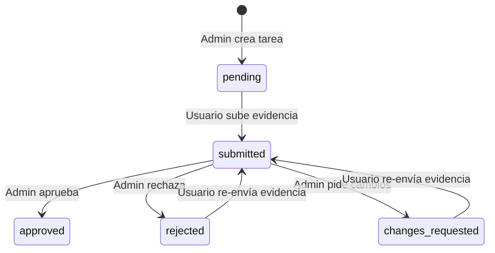

# EvidenceFlow — Arquitectura del Sistema

## Estructura de Carpetas

```
src/
├── actions/              # Server Actions (Next.js) — thin wrappers
│   ├── auth.ts           # Login, signup, logout
│   ├── evidence.ts       # Upload y consulta de evidencia
│   └── tasks.ts          # Crear y revisar tareas
│
├── app/                  # Páginas y layouts (App Router)
│   ├── dashboard/        # Panel principal
│   ├── login/            # Autenticación
│   └── tasks/[id]/       # Detalle de tarea y evidencia
│
├── components/           # Componentes React reutilizables
│   ├── layout/           # Navbar, etc.
│   └── ui/               # Button, Card, Input, Modal, FileUpload, Pagination
│
├── lib/                  # Lógica compartida
│   ├── services/         # Capa de servicios (lógica de negocio pura)
│   │   ├── auth.service.ts
│   │   ├── tasks.service.ts
│   │   ├── evidence.service.ts
│   │   └── index.ts      # Barrel export
│   └── supabase/
│       ├── server.ts     # Cliente Supabase para server-side
│       └── queries.ts    # Queries de solo lectura para Server Components
│
├── proxy.ts              # Middleware (refresco de sesión)
│
supabase/
└── migrations/           # Migraciones SQL versionadas
    ├── 001_initial_schema.sql
    ├── 002_rls_policies.sql
    ├── 003_storage_setup.sql
    └── 004_harden_security.sql

docs/
└── ARCHITECTURE.md       # Este archivo
```

---

## Capas de la Aplicación

### 1. Presentación (`app/`, `components/`)
- Componentes React (Client Components con `'use client'`).
- Server Components para data fetching inicial (`page.tsx`).
- **NO contienen lógica de negocio** — solo renderización y eventos de UI.

### 2. Server Actions (`actions/`)
- Thin wrappers que:
  1. Extraen datos de `FormData`.
  2. Obtienen el cliente Supabase autenticado.
  3. Delegan al servicio correspondiente.
  4. Llaman `revalidatePath` para invalidar caché de Next.js.
- **NO contienen lógica de negocio** — solo orquestación de Next.js.

### 3. Servicios (`lib/services/`)
- **Contienen toda la lógica de negocio pura**.
- Reciben un `SupabaseClient` como dependencia (inyección).
- Son agnósticos de Next.js — se pueden reutilizar en:
  - Route Handlers REST (`/api/...`)
  - Backend separado (Express, Fastify)
  - Tests unitarios (con Supabase mockeado)
- **Validación de datos** vive aquí (e.g., decisiones válidas de revisión).

### 4. Queries (`lib/supabase/queries.ts`)
- Queries de solo lectura para Server Components.
- Obtienen perfiles, tareas, y evidencia para renderizado inicial.
- RLS filtra automáticamente según el usuario autenticado.

### 5. Base de Datos (Supabase + RLS)
- **Contiene las reglas de autorización** vía Row Level Security.
- Es la última línea de defensa — incluso si hay un bug en el frontend.

---

## Dónde Viven las Reglas de Negocio

| Regla | Capa | Archivo |
|-------|------|---------|
| Un usuario NO puede registrarse como admin | Servicio + DB | `auth.service.ts` + `001_initial_schema.sql` (trigger) |
| Un usuario solo puede subir evidencia para SUS tareas asignadas | DB (RLS) | `002_rls_policies.sql` (policy `evidence_user_insert`) |
| Un usuario solo puede cambiar status a 'submitted' | DB (RLS) | `002_rls_policies.sql` (policy `tasks_user_submit`) |
| Un usuario solo puede enviar desde estados válidos (pending/changes_requested/rejected) | DB (RLS) | `002_rls_policies.sql` (USING clause valida estado previo) |
| Solo admins pueden aprobar/rechazar/solicitar cambios | DB (RLS) | `002_rls_policies.sql` (policy `tasks_admin_all`) |
| Solo admins pueden crear tareas | DB (RLS) | `002_rls_policies.sql` (policy `tasks_admin_all`) |
| Solo admins pueden eliminar evidencia o archivos | DB (RLS) | `002_rls_policies.sql` + `003_storage_setup.sql` |
| Feedback es obligatorio al rechazar o pedir cambios | Servicio | `tasks.service.ts` (validación en `reviewTaskService`) |
| Archivos se almacenan en carpeta del usuario | Servicio + DB | `evidence.service.ts` + `003_storage_setup.sql` |

---

## Flujo de Estados de una Tarea



### Transiciones Permitidas por RLS

| Estado Actual | → Nuevo Estado | Quién Puede |
|---|---|---|
| `pending` | `submitted` | Usuario asignado |
| `changes_requested` | `submitted` | Usuario asignado |
| `rejected` | `submitted` | Usuario asignado |
| `submitted` | `approved` | Admin |
| `submitted` | `rejected` | Admin |
| `submitted` | `changes_requested` | Admin |

---

## Convenciones de Migraciones SQL

1. Los archivos se nombran con formato: `NNN_descripcion.sql` (e.g., `004_harden_security.sql`).
2. Cada migración debe ser **idempotente** cuando sea posible (usar `IF NOT EXISTS`, `DROP IF EXISTS`).
3. Nuevas migraciones se agregan al final — nunca se modifican migraciones ya aplicadas.
4. Para bases de datos existentes, solo ejecutar la migración más reciente (e.g., `004_harden_security.sql`).
5. Para bases de datos nuevas, ejecutar todas las migraciones en orden (001 → 002 → 003 → 004).

---

## Seguridad — Defensa en Profundidad

```
┌─────────────────────────────────────────┐
│  1. UI (login/page.tsx)                 │  ← No muestra selector de rol admin
├─────────────────────────────────────────┤
│  2. Server Action (actions/auth.ts)     │  ← Ignora rol del FormData
├─────────────────────────────────────────┤
│  3. Servicio (auth.service.ts)          │  ← Hardcodea role='user'
├─────────────────────────────────────────┤
│  4. DB Trigger (handle_new_user)        │  ← Hardcodea role='user'
├─────────────────────────────────────────┤
│  5. RLS Policies                        │  ← Bloquea operaciones no autorizadas
└─────────────────────────────────────────┘
```

Cada capa es independiente. Si un atacante logra saltarse una, la siguiente lo detiene.

---

## Preparación para App Nativa

La capa de servicios (`lib/services/`) está diseñada para ser importada desde cualquier contexto de servidor:

```typescript
// Ejemplo futuro: Route Handler REST para app nativa
// src/app/api/tasks/route.ts

import { createTask } from '@/lib/services';
import { createRouteHandlerClient } from '@supabase/auth-helpers-nextjs';

export async function POST(request: Request) {
  const supabase = createRouteHandlerClient({ cookies });
  const body = await request.json();
  const result = await createTask(supabase, body);
  return Response.json(result);
}
```

No se necesita duplicar lógica — solo crear nuevos puntos de entrada HTTP.
